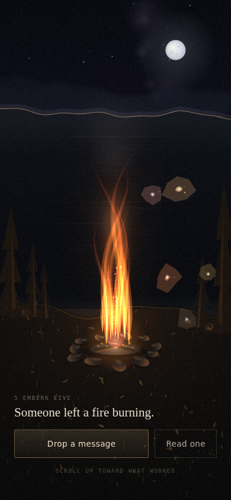

# Little Bonfire

An anonymous, mood-based messaging app modeled on the Dark Souls / Elden Ring
message system: brief, templated notes left for strangers around a shared
campfire. No profiles, no feeds, no replies — you open the app because you
feel something, and either read or drop.

**Live:** **[little-bonfire.vercel.app](https://little-bonfire.vercel.app/)**



## How it works

- **Kindling** — five moods to choose from, each its own scarcity pool and
  color: **Disgrace** ("you did the thing you said you wouldn't"), **Ruin**
  ("something broke and you don't know if it's fixable"), **Vigil**
  ("waiting on something you can't control"), **Resolve** ("decided
  something, need it to hold"), and **Grace** ("a good moment you don't want
  to lose") — the one kindling with no cap.
- **Templates, not free text** — every drop is built by filling in blanks
  from a mood-specific template ("flavor"), forcing specificity over generic
  positivity. Each kindling has several flavors, ordered so the one most
  people are likely to reach for loads first by default. Every blank's
  option set spans from broadly universal to vividly specific, so someone's
  real experience can land close to what actually happened without the
  option list ever pinning the story to one narrow scenario.
- **Scarcity** — each kindling has a fixed number of slots. Dropping a
  message fills one; a kindling goes read-only once full. Slots free up when
  a message is marked "this helped" — retirement as a form of success, not
  moderation. Every live message also ages out on its own after 9 days,
  helped or not.
- **The bonfire** — the home screen: a hand-built, fully procedural canvas
  scene (no image assets) of a campfire beside a lake at night. Live
  messages drift above the fire as embers, colored per kindling and tinted
  warm so they read as coals rather than flat gems; "this helped" messages
  rise off the fire to become one more star in the sky, and the shoreline's
  own shape shifts with how full each kindling's scarcity pool is.

## Screens

- **Home** — tap the fire to reveal it (embers become tappable, "Drop a
  message" / "Read one" appear); scroll or drag up to climb into the star
  field and see the running "stars risen" count. Tapping an ember opens it
  directly, with "this helped" / "not this" on the spot. Tapping the moon
  (while it's visible) is a small Easter egg.
- **Read one** — a dedicated, distraction-focused screen for browsing
  messages at random, independent of the fire — swipe or scroll for
  another, no voting here (that lives on embers you deliberately tap).
- **Kindling → Compose → Confirm** — "Drop a message" opens the kindling
  picker, then a compose screen with a scroll-snapped "rolodex" for picking
  the mood's flavor and a template sentence with tap-to-fill blanks, then a
  confirmation screen once the ember is released into the fire.

## Stack

React + Vite. Persistence is Supabase (Postgres) when configured — see
**Database setup** below — with an in-memory local fallback so the app runs
and deploys fine before that's done. Hosting is Vercel (writes go through
its serverless functions) with a GitHub Pages deploy also kept around as a
read-mostly fallback — see **Hosting**.

## Development

```bash
cd app
npm install
npm run dev
```

This runs the local fallback only — `/api/*` (the serverless functions)
aren't served by plain `vite dev`. To exercise the real write path locally,
install the [Vercel CLI](https://vercel.com/docs/cli) and run `vercel dev`
from `app/` instead, with `app/.env` filled in (see **Database setup**).

## Build

```bash
cd app
npm run build
```

## Hosting

**Vercel** is the primary target — it's the only one of the two that can
run `app/api/drop.js` and `app/api/help.js`, which is what makes writes
secure (see **Security** below). The live deployment is
[little-bonfire.vercel.app](https://little-bonfire.vercel.app/).

1. Import this repo into a new Vercel project.
2. Set its **Root Directory** to `app`. Vercel auto-detects the Vite
   framework preset from there — no other config needed (`app/vercel.json`
   supplies the security headers).
3. Add the three env vars from **Database setup** below in the project's
   Settings → Environment Variables.
4. Push to `main` (or trigger a deploy) — Vercel builds and serves
   `app/dist`, with `app/api/*.js` deployed alongside as serverless
   functions automatically.

**GitHub Pages** (`.github/workflows/deploy.yml`) still deploys on every
push to `main`, unchanged, as a second, static-only copy. It can read the
same database (if `VITE_SUPABASE_URL`/`VITE_SUPABASE_ANON_KEY` are also
added as GitHub repo secrets) but **cannot write to it** — Pages can't host
serverless functions, and there's deliberately no way to write to the
database that doesn't go through one (see **Security**). Without those
secrets it runs in local-only mode instead, same as before any of this
existed. Keeping it around costs nothing and is a reasonable fallback if
Vercel is ever down.

## Database setup

Without the keys below, the app runs in **local-only mode**: a handful of
seed messages, nothing persisted across reloads, nothing shared between
visitors — it still works and deploys fine, just like before any of this
was added. Doing the setup below makes drops real: they persist, and
everyone who opens the site sees the same fire.

1. Create a free project at [supabase.com](https://supabase.com) (or
   provision one from Vercel's Marketplace/Integrations tab, which does the
   same thing and can auto-sync the env vars into your Vercel project).
2. In the project's SQL Editor, paste in the full contents of
   [`db/schema.sql`](db/schema.sql) and run it. It creates the `messages`
   table, the read-only-after-9-days view, row-level security policies, a
   rate-limited insert, and a safe `mark_helped` function — see the
   comments in that file for what each piece does and why.
3. In the project's **Settings → API**, copy the **Project URL**, the
   **anon public** key, and the **service_role** key (keep this one secret
   — see **Security**).
4. Add all three as env vars on the **Vercel** project (Settings →
   Environment Variables): `VITE_SUPABASE_URL`, `VITE_SUPABASE_ANON_KEY`,
   and `SUPABASE_SERVICE_ROLE_KEY`.
5. If also keeping GitHub Pages up (see **Hosting**), add just the first
   two — `VITE_SUPABASE_URL` and `VITE_SUPABASE_ANON_KEY` — as GitHub repo
   secrets (Settings → Secrets and variables → Actions). **Never** put the
   service_role key there; Pages has nowhere server-side to keep it safe.
6. For local dev, copy `app/.env.example` to `app/.env` and fill in all
   three.

That's the whole setup — no other code changes needed.
`app/src/lib/store.js` picks the Supabase-backed implementation
automatically as soon as the first two are present
(`app/src/lib/supabase.js` is what checks); `app/api/drop.js`/`help.js` do
the same check for the service_role key server-side.

## Security

Writes (dropping a message, marking one "this helped") go through
`app/api/drop.js` and `app/api/help.js` instead of letting the browser
write to Supabase directly. Those two functions hold the **service_role**
key, which bypasses Supabase's row-level security entirely — and there is
deliberately no insert/update policy granted to the public anon key at all.
So even someone who reads the anon key straight out of the deployed JS
bundle (it's meant to be public — that's normal for Supabase) and calls the
REST API directly can only ever *read*, never write. Reads (`live_messages`,
the "stars risen" count) stay a direct, unauthenticated call from the
browser to Supabase, since none of that is sensitive.

`app/vercel.json` adds standard hardening headers (CSP,
`X-Frame-Options: DENY`, HSTS, a locked-down `Permissions-Policy`, etc.) —
something GitHub Pages doesn't support setting at all, so this is
Vercel-only. The CSP's `style-src` needs `'unsafe-inline'` because the app
uses React's `style={{...}}` props throughout, which render as inline
`style=""` attributes; `script-src` has no such exception, which is what
actually matters for blocking injected script execution.

**Known limits, honestly stated:**
- The anti-spam protection is two independent soft rate limits — a
  per-browser token (`localStorage`, trivially cleared) and a hashed-IP
  check computed server-side in `app/api/drop.js` (harder to fake, but IPs
  are shared behind NAT/offices and can be rotated) — plus a length check
  on the text. Not real abuse protection against someone determined to spam
  this. A CAPTCHA, or a proper token-bucket rate limiter backed by Vercel
  KV/Upstash, would be the next step if that becomes a problem.
- Stars ("this helped" count) and the embers on the fire aren't synced live
  across open tabs/visitors — each session fetches once on load. Supabase
  Realtime could be added later for that; it wasn't included here to keep
  the write path's first pass simple and testable.
- The write path (`app/api/drop.js`/`help.js`) was unit-tested in isolation
  (input validation, method checks, the "backend not configured" path) with
  a mocked request/response and a Supabase client pointed at a fake
  project. If you're standing up your own Supabase project, treat the first
  real deploy as the actual end-to-end test of the write path: drop a
  message, check the browser Network tab and the Vercel function logs for
  `/api/drop`, and confirm the row shows up in Supabase's table editor
  before trusting it fully.

## Project structure

```
app/
  src/
    App.jsx              screen routing + all shared state
    BonfireCanvas.jsx     the procedural fire/lake/sky canvas scene
    data.js               kindling definitions: templates, blanks, colors
    screens/
      HomeScreen.jsx       the fire, reveal state, moon Easter egg
      KindlingScreen.jsx   mood picker
      ComposeScreen.jsx    template rolodex + fill-in-the-blanks
      TemplateRolodex.jsx  the scroll-snapped flavor picker
      ConfirmScreen.jsx    "ember released" confirmation
      ReadScreen.jsx       standalone random-message browsing
    lib/
      store.js            Supabase-or-local-fallback data layer
      supabase.js         browser Supabase client (read-only)
      clientToken.js      per-browser anti-spam token
  api/
    drop.js               serverless: insert a message (service_role)
    help.js               serverless: mark a message "helped"
    _supabaseAdmin.js     shared service_role client for the two above
  vercel.json             security headers (Vercel only)
db/
  schema.sql              table, RLS policies, rate limiting, RPCs
.github/workflows/
  deploy.yml              GitHub Pages fallback deploy
```
